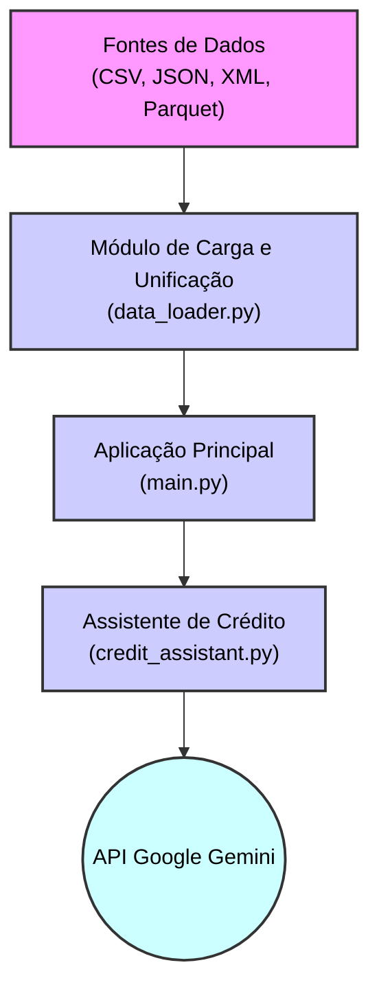

# Desafio Banese Labs - Assistente de Análise de Crédito

Este projeto implementa um Assistente de Análise de Crédito Inteligente usando IA Generativa para otimizar o processo de concessão de empréstimos a PMEs.

## Arquitetura da Solução

O diagrama abaixo ilustra a arquitetura e o fluxo de dados da aplicação:

